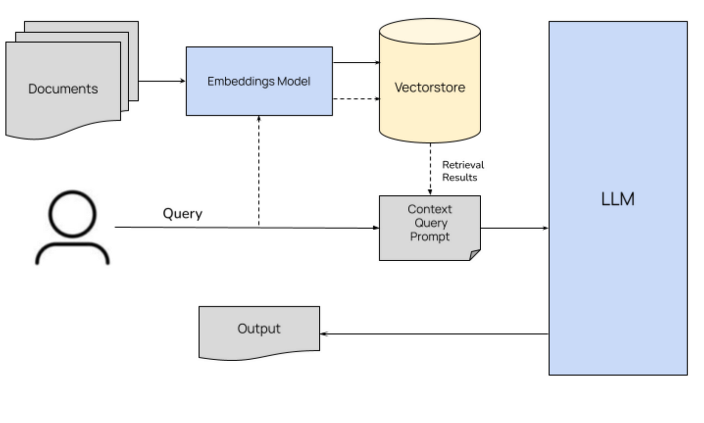
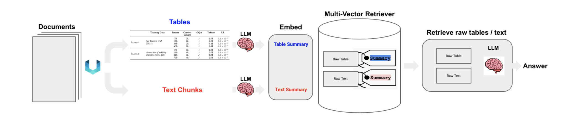
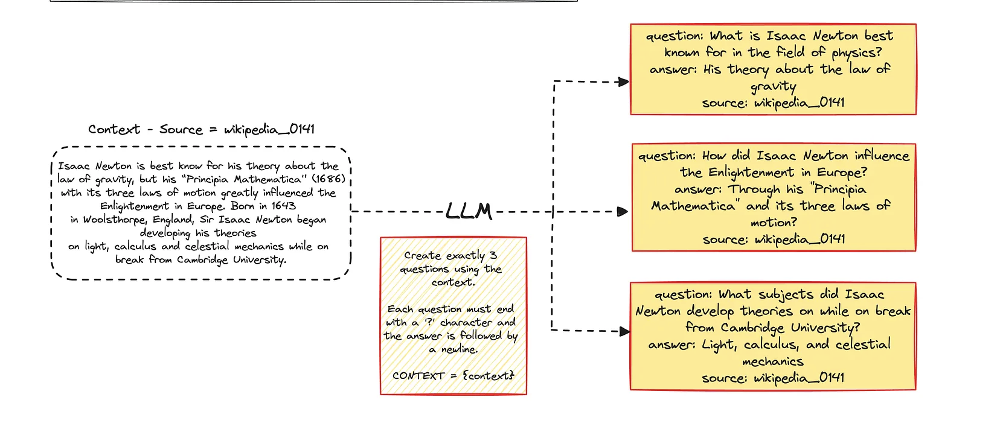

# RAG_assignment
RAG evaluation and comparison of RAG pipelines

For this assignment, I am using the high level architecture to achieve our objective. I am leveraging langchain for most of this exercise as it provides a lot of out of box options for performing a lot of tasks involved in setting up RAG.

**High level architecture**

The key steps involved in the process are:

**1) Loading & Processing input data**

For text only documents, reading in pdf documents is fairly straightforward using pypdf. However in our particular case the document consists of text & tables. Using traditional methods results in challenges for semi-structured data listed below

-Text splitting may break up tables, corrupting the data in retrieval
-Embedding tables may pose challenges for semantic similarity search

Hence I used the partition_pdf method from unstructured library.Unstructured helps in getting clean model ready data. It segments a PDF document by using a layout model.This layout model makes it possible to extract elements, such as tables, from pdfs.We also can use Unstructured chunking, which
-Tries to identify document sections (e.g., Introduction, etc)
-Then, builds text blocks that maintain sections while also honoring user-defined chunk sizes

**2) Summarizing data**

We are using a multi-vector retriever to produce summaries of both tables and text. The advantage of this is that we can summarize each chunk which is then converted into an embedding. However at retrieval step, this embedding can trace back to the original chunk(and not the summarized chunk) which is much broader and contains more information which is important context for the LLM. For example: The raw tables are passed to the LLM, providing the full table context for the LLM to generate the answer.Summaries are used to improve the quality of retrieval

**3) Vectorizing data**

Once we have the summarized data, we are vectorizing the summaries and storing the embeddings in a vector database called Chroma. As scale increases, we could rely on fully-managed vector databases like pinecone. But for this exercise, Chroma suffices. With respect to embeddings, in this case we have the option to use either OpenAI embeddings or Cohere embeddings. Both are trained extensively and provide good embedding options. If we are worried about cost, other option is leveraging open source embeddings from BGE(Bi-encoder Generative Embeddings) models like sentence transformer 3 which provides a solid base upon which we can fine-tune the embeddings for our specific task. So at the end of this step, the summary embeddings are stored in the vectorestore and the corresponding chunks of data are stored in a docstore using the same doc_id so that they can be matched later in the retrieval step. Another important point to note here is that given we have multiple documents, we need a way to tag the chunks of text with the associated document for retrieval later on. We are leveraging the metadata filter option of the vectorstore to achieve this.

**Multi-vector retriever**

**4) Setting up the retriever**

The retriever's functionality is essentially to retrieve the relevant chunks of data given the input query. There are multiple ways this can be achieved. The most popular ones are:

**a)Traditional text search**: We can use traditional text matching methods/alogorithms which match the exact words found in the query with the chunked documents.Some of the common methods are TF-IDF and BM25
The pros of this method are:
-Fast
-Scalable
Cons:
-Matches syntactically but fails in semantic matching
-Generated poor matches with synonymous words which are not exact matches

**b)Vector search**: We match the input query converted to vector with the vectors in the vector database generated from summaries.
The pros of this method are:
-Matches semantically equivalent sentences
-Filters out the noise from the content
Cons:
-Relatively slow compared to traditional text search

**c)Hybrid search**: Using a combination of vector search and text search. Tries to get the best of both worlds.
The pros of this method are:
-Matches both syntatactically and semnatically
Cons:
-Maintenance of 2 approaches

In this exercise, we are focusing on Vector search and Hybrid search only 

**5) Generating response** using context from retriever + query input to LLM

For the LLM, in addition to the query we want to provide it with the context so it can respond accurately. To extract the context, we convert the query into an embedding and then look for similar embeddings in the vector database. Once we find them, we can retrieve the corresponding data chunks and pass it to the LLM as context. Additionally, I am using the metadata to filter results specific to a given document based on its mention in the query.

Another option for generator is to fine-tune an open-source LLM like LLama or Mistral to answer the questions. Given time constraints, I have left this out of the code currently.

**6) Creating a synthetic Question & Answer set for evalaution.**

In the absence of a goldent dataset or dataset with questions & ground truth, I needed to find an alternative. The next best alternative was to create a synthetic dataset of question and answer pairs and then use these questions as input to the RAG pipeline to find the response. This way we can evaluate the expected/actual response with the RAG generated response and check for consistency.
The way this was done was by taking each chunk of text and asking the LLM to generate x question and answer pairs for each doc_id/chunk of data. This way a dataset of question & answer pairs was compiled.

**7) Evaluating the pipeline**(Retriever evaluation & Generator evaluation)

There are 2 parts of the pipeline we can evaluate.

**a) The Retriever**:

We are evaluating the efficacy of the retriever by checking whether the relevant document appears in the retrieved results or not. Calling this Hit rate

Hit rate(Recall)=1 if relevant result present in retrieved results else 0

This is averaged across all the questions to get the overall Hit rate

There are other metrics like MRR, Precision@K, Recall@K which can be used here depending on the usecase.

**b) The Generator**:

For generator, I am using sentence transformer to convert the expected answer and the system generated answer to embeddings and then calculating cosine similarity to understand how similar they are. This is averaged across all the question answers to generate the average generator accuracy.

Other ways to do this could be by using a different LLM to evaluate the predicted answer given the expected answer to give a score between 0 and 1.

Created a dockerfile to build a docker image. Tested the corresponding docker container and ran successfully. Please note OPEN_API_KEY and COHERE_API_KEY need to be passed as environment variables for the docker container to run.

**References**:

https://github.com/langchain-ai/langchain/blob/master/cookbook/Semi_Structured_RAG.ipynb

https://python.langchain.com/docs/how_to/multi_vector/

https://python.langchain.com/api_reference/langchain/retrievers/langchain.retrievers.multi_vector.MultiVectorRetriever.html

https://docs.ragas.io/en/stable/concepts/metrics/index.html

https://haystack.deepset.ai/blog/extracting-metadata-filter

https://thetechbuffet.substack.com/p/rag-evaluation

https://jakobs.dev/evaluating-rag-synthetic-dataset-generation/

